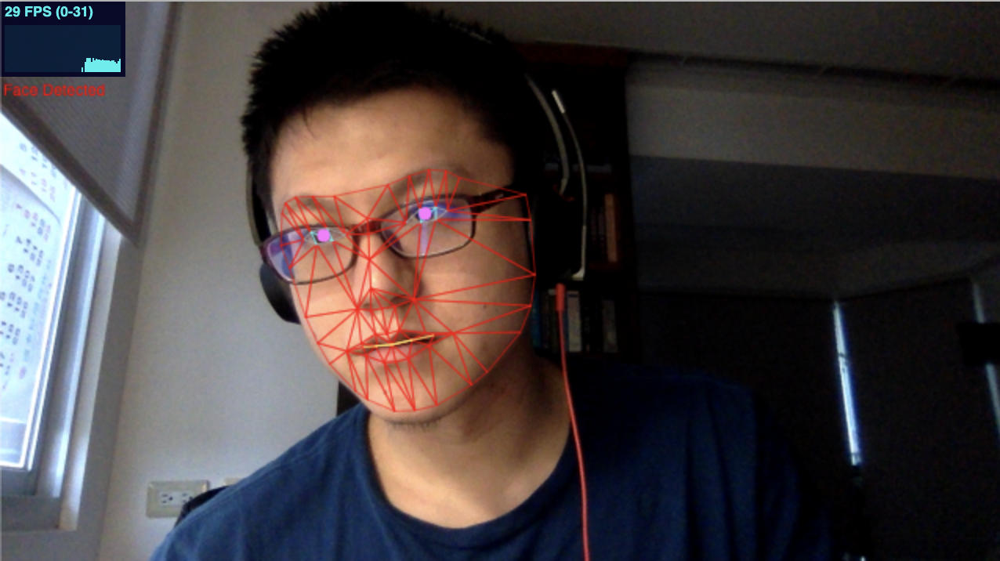

# Minimal Face Mesh

This project uses TF.js to calculate the facial landmarks.

[DEMO](https://wei-1.github.io/minimum-facemesh/)

There are many Demos out there that are too complex. This repository is the minimum setup that I developed that contains a reasonable amount of component.

This repo uses that latest dependencies from Google at 2021-04-12:
 - tfjs@3.3.0
 - face-landmarks-detection@0.0.3

There are 5 files in this repo:
 - README.md (this file)
 - index.html (include the dependencies and JS files)
 - landmarks.js (facial landmarks index)
 - sketch.js (integration and logic)
 - sample.png (DEMO image)

If you want to try this repo by yourself, you can clone the project and use [http-server](https://www.npmjs.com/package/http-server) to host the `index.html` file.

----

### Note

 - I saw more than 10% frame rate improvement jumping from TF.js `2.4.0` to TF.js `3.3.0`.
 - Model `face-landmarks-detection@0.0.3` seems to be slightly more stable than `facemesh@0.0.5`, but the difference is hard to tell.
 - I am using MacBook, and I had tried several methods (including plaid-ml) to utilize my MacBook's GPU to do the job. At the end, using WebGL with TF.js is the easiest and the fastest solution.
